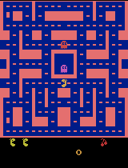
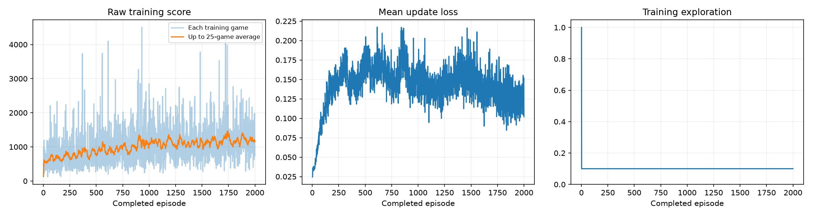
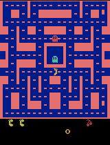

# Training a Ms. Pac-Man agent with a Deep Q-Network

Class 3 assignment. A DQN is trained from raw pixels on `ALE/MsPacman-v5` using the course
notebook, and evaluated against an untrained network on five fixed seeds under identical settings.

- **Notebook (executed, with outputs):** [`pacman_dqn.ipynb`](pacman_dqn.ipynb)
- **Evidence:** [`results/`](results/)

> **A note for the grader on viewing gameplay in the notebook.** The notebook's own gameplay clips
> are stored as `image/gif` outputs, and **GitHub's static notebook viewer does not render that MIME
> type** — it prints `<IPython.core.display.Image object>` instead. I verified this is not a problem
> with the saved file: the GIF data is present in the `.ipynb`, and `nbconvert --to html` drops it
> the same way, so it affects any run of this notebook rather than this one specifically. The
> **scores, the training dashboard, and every printed result do render on GitHub.** All 82 gameplay
> GIFs are additionally saved as files under [`results/demos/`](results/demos/) and embedded
> throughout this README, where they display correctly.

**Result: mean score over five fixed evaluation seeds went from 492.0 (untrained) to 1360.0
(trained) — a gain of +868.0, or +176%. All five games improved.**

| | Untrained | Trained |
|---|---|---|
| Mean over 5 seeds | 492.0 | **1360.0** |

| Untrained agent | Best trained game |
|---|---|
|  |  |

*Both clips are the first 20 seconds of game time at 4× playback.*

## How to open and run it

**Google Colab**
[](https://colab.research.google.com/github/adityasankar98/pacman-dqn-class3/blob/main/pacman_dqn.ipynb)

Select **Runtime → Change runtime type → T4 GPU**, then **Runtime → Run all**. The first cell
installs everything.

**Locally (what this run used)**

```sh
git clone https://github.com/adityasankar98/pacman-dqn-class3.git
cd pacman-dqn-class3
python3.12 -m venv .venv && source .venv/bin/activate
pip install -r requirements.txt
python -m jupyter lab pacman_dqn.ipynb
```

Select a Python 3.11–3.13 kernel and choose **Run All**. CUDA, Apple MPS, and CPU are detected
automatically. Every run writes a fresh timestamped folder under `pacman_runs/` plus a ZIP.

## My three choices

| Setting | Notebook default | **My value** |
|---|---|---|
| Exploration | 0.20 | **0.10** |
| Episodes | 100 | **2000** |
| Learning rate | 0.0001 | **0.00025** |

### Exploration — 0.10

Exploration in this notebook is **constant**: after 1,000 warm-up decisions, epsilon never decays.
That changes what the number means. At the default 0.20, one move in five stays random for the
entire run, so the agent is permanently prevented from executing the policy it is learning, and
every transition it stores is drawn from a heavily randomised behaviour policy. Halving it to 0.10
keeps enough randomness to reach states the greedy policy would never visit, while letting the
learned policy actually express itself in both the collected experience and the training score.

I did not go as low as 0.05 (the fixed evaluation value). A randomly-initialised network tends to
favour one action, and with very little exploration the agent can spend long stretches pinned in a
corner, collecting almost no useful experience early on.

### Episodes — 2000

I measured throughput before committing: a five-episode setup check ran at roughly 142–220
decisions per second on this machine, so 2,000 episodes was affordable in about two hours.

2,000 episodes is roughly 1.2M agent decisions, or ~4.8M emulator frames. That matters because the
notebook's 100-episode default is only ~60k decisions — far too few for an Atari DQN to show
anything but noise. The original DQN paper trains for tens of millions of frames; 2,000 episodes
does not approach that, but it is enough to get past the regime where the result is purely the
random initialisation.

### Learning rate — 0.00025

0.00025 is the rate used in the original DQN work, and is 2.5× the notebook's reference value. The
argument for the larger step is the update budget: this run performs on the order of 10^5 gradient
updates, not the 10^7 the method was designed around, so each update has to carry more weight.

The risk of a larger step is divergence, but the notebook already mitigates it: Huber
(`smooth_l1_loss`) instead of squared error, gradient-norm clipping at 10.0, a target network synced
every 1,000 decisions, and an explicit error if the loss ever becomes non-finite.

### One further change, declared: replay capacity 5,000 → 50,000

The assignment permits tuning other hyperparameters with an explanation. I changed exactly one.

The shipped replay buffer holds 5,000 transitions — at roughly 600 decisions per game, that is about
**eight games**. Every sampled batch is therefore drawn from a handful of very recent, highly
correlated episodes, which is precisely the correlation that experience replay exists to break. I
raised it to 50,000 (about 80 games).

I verified the cost rather than assuming it. At a full 50,000 the notebook's `sample()` takes
0.53 ms versus 0.19 ms at 5,000 — about one extra minute per 100,000 updates — at 1.08 GiB of
resident memory. Negligible against a two-hour run on a 16 GB machine.

**Everything else is exactly as shipped**, including every setting that makes runs comparable:
`SEED = 42`, `MAX_STEPS = 3000`, `BATCH_SIZE = 32`, `WARMUP_STEPS = 1000`, `TRAIN_EVERY = 4`,
`TARGET_EVERY = 1000`, `GAMMA = 0.99`, `DEMO_EVERY = 25`, and — critically — the evaluation settings
`EVAL_SEEDS = [101, 202, 303, 404, 505]` and `EVAL_EXPLORATION = 0.05`. These can be checked in
[`results/config.json`](results/config.json).

The only other edit was `SHOW_POPUPS = False`, because the run was executed headlessly; the starter
README documents this as the inline-playback setting. It does not affect the agent.

## What the agent actually sees, does, and is paid for

**Observations — four game screens.** Each Atari frame is cropped and shrunk to an 84×84 grayscale
image, and the four most recent are stacked into one 4×84×84 observation. Four frames rather than
one because a single still image cannot show *motion*: from one frame you cannot tell whether a
ghost is closing in or moving away. One decision covers four emulator frames, so the agent acts
about 15 times per second of game time.

**Actions — the joystick.** Nine discrete actions, exactly what a physical Atari stick could do:
`NOOP, UP, RIGHT, LEFT, DOWN, UPRIGHT, UPLEFT, DOWNRIGHT, DOWNLEFT`. The network outputs one number
per action — its estimate of the total future reward from taking that action here — and the agent
normally picks the highest, taking a random action 10% of the time during training.

**Rewards — game points.** The reward is whatever the game's own scoreboard awards: pellets, power
pellets, eaten ghosts, fruit. Two details matter. For *learning*, rewards are clipped to [−1, +1],
so a 200-point ghost and a 10-point pellet look the same size to the gradient — this keeps the
update scale stable across games but means the agent is not taught that ghosts are worth twenty
pellets. For *reporting*, every score in this README is the raw, unclipped game score.

The agent is never told the rules. It is not told what a ghost is, that pellets are good, or that
touching a ghost ends a life. All of that has to be inferred from pixels and points.

## What I expected, and what actually happened

**Before training I expected a modest, noisy improvement at best.** The reasoning: 2,000 episodes is
~4.8M emulator frames, which is one to two orders of magnitude short of what DQN normally needs on
Atari, and Ms. Pac-Man is one of the harder games for value-based methods because the reward is
dense and the ghosts make the useful policy depend on long-range planning. I thought the most likely
outcome was a small gain buried in noise, with a real chance of no measurable improvement, and I
expected training loss to fall as the network fit its targets.

**Two of those three expectations were wrong.**

The improvement was not modest and it was not ambiguous: the mean went from 492.0 to 1360.0, and
**every one of the five evaluation games improved**, which is much stronger evidence than the mean
alone. Getting 5 out of 5 in the same direction is unlikely under noise.

And the loss went **up**, not down — from about 0.03 early to a plateau around 0.15 — during exactly
the period when play was improving fastest. This is the assignment's warning made concrete. The loss
here is a *temporal-difference error*, not a distance from ground truth. As the agent learns to
survive and collect more, the true value of its states genuinely rises, the target network keeps
being refreshed to a stronger network, and so the quantity being minimised is itself growing. A
falling loss in this setup could just as easily have meant the agent had settled into a dull,
predictable policy. **The loss panel is the least informative of the three.**

### All five evaluation scores

Same five seeds, 5% exploration, same 3,000-decision cap, before and after. The baseline is an
untrained network, not a random-action agent. Full data: [`results/comparison.json`](results/comparison.json).

| Game | Seed | Before (untrained) | After (trained) | Change |
|---|---|---|---|---|
| 1 | 101 | 350 | **1400** | +1050 |
| 2 | 202 | 500 | **1740** | +1240 |
| 3 | 303 | 320 | **1240** | +920 |
| 4 | 404 | 800 | **1510** | +710 |
| 5 | 505 | 490 | **910** | +420 |
| **Mean** | | **492.0** | **1360.0** | **+868.0** |

The agent also survived longer: mean game length rose from 589 to 764 decisions. No game hit the
3,000-decision time limit in either condition, so every score is a real game-over, not a truncation.

### Training curve



Averaged into blocks of 250 episodes, the training-time trend is monotonic:

| Episodes | Mean score | Mean game length |
|---|---|---|
| 1–250 | 672.9 | 580 |
| 251–500 | 801.9 | 615 |
| 501–750 | 929.2 | 661 |
| 751–1000 | 1040.3 | 702 |
| 1001–1250 | 1113.4 | 730 |
| 1251–1500 | 1117.8 | 705 |
| 1501–1750 | 1179.6 | 731 |
| 1751–2000 | **1184.5** | 755 |

These are scores at 10% exploration, so they sit below the 5% evaluation numbers. Per-episode scores
(the pale band in the plot) swing between roughly 200 and 4,500 throughout — individual games say
almost nothing, which is why the block averages are the honest view.

### Gameplay through training

| Untrained | 250 games | 500 games |
|---|---|---|
|  |  |  |
| score 350 | demo 940 | demo 1060 |

| 1000 games | 1575 games (selected) | 2000 games (final) |
|---|---|---|
|  |  |  |
| demo 1080 | demo 1400 | demo 1010 |

<details>
<summary><b>All 80 intermediate GIFs</b> (one every 25 episodes) — click to expand</summary>

Every file is in [`results/demos/`](results/demos/), named `episode_NNNN.gif`. Their scores are in
[`results/demo_scores.json`](results/demo_scores.json). Note these are **single** evaluation games,
so they are extremely noisy — the same agent scores 360 on one seed and 2,250 on another.

| | | | |
|---|---|---|---|
|  25 |  50 |  75 |  100 |
|  125 |  150 |  175 |  200 |
|  225 |  250 |  275 |  300 |
|  325 |  350 |  375 |  400 |
|  425 |  450 |  475 |  500 |
|  525 |  550 |  575 |  600 |
|  625 |  650 |  675 |  700 |
|  725 |  750 |  775 |  800 |
|  825 |  850 |  875 |  900 |
|  925 |  950 |  975 |  1000 |
|  1025 |  1050 |  1075 |  1100 |
|  1125 |  1150 |  1175 |  1200 |
|  1225 |  1250 |  1275 |  1300 |
|  1325 |  1350 |  1375 |  1400 |
|  1425 |  1450 |  1475 |  1500 |
|  1525 |  1550 |  1575 |  1600 |
|  1625 |  1650 |  1675 |  1700 |
|  1725 |  1750 |  1775 |  1800 |
|  1825 |  1850 |  1875 |  1900 |
|  1925 |  1950 |  1975 |  2000 |

</details>

### Which network was reported, and why

The notebook by default reports the **final** weights. Because exploration never decays, a long run
can peak and then drift, so I added one cell (section 6a-i) that chooses which checkpoint to report
using **five held-out seeds — 1001, 2002, 3003, 4004, 5005 — that are not the reported five**.
Everything else matches evaluation exactly.

This matters, because the final weights were not the best:

| Checkpoint | Held-out mean (seeds 1001–5005) |
|---|---|
| **episode 1575 (selected)** | **1660.0** |
| episode 850 | 1612.0 |
| episode 950 | 1498.0 |
| episode 1325 | 1498.0 |
| episode 1875 | 1476.0 |
| episode 2000 (final weights) | 1302.0 |

Full table for all 81 candidates: [`results/checkpoint_selection.json`](results/checkpoint_selection.json).

**The honest caveat:** picking the maximum of 81 noisy estimates means the *held-out* figure of
1660.0 is optimistically biased — some of that 1660 is luck. What is **not** biased is the reported
1360.0, because seeds 101/202/303/404/505 were never used to make the choice. That is the whole
point of separating the two seed sets. Note also that the selected checkpoint's held-out mean
(1660.0) is well inside the spread of the top candidates (1660 down to 1436), so "episode 1575 is
the true optimum" is not a claim I can support — only that it is a reasonable pick made without
touching the test seeds.

## The run that produced these numbers

| | |
|---|---|
| Status | completed (not interrupted) |
| Completed episodes | **2,000 / 2,000** |
| Total decisions | **1,369,832** (~5.5M emulator frames) |
| Learning updates | **342,209** |
| Elapsed training time | **108.5 min** (6,512 s, including periodic demos) |
| Total notebook wall-clock | 114.0 min (includes baseline eval, 81-checkpoint selection, final eval) |
| Hardware | Apple M4, 10 cores, 16 GB, macOS 15.6.1 |
| Device | **MPS** (Apple Silicon GPU) |
| Python | 3.12.14 |
| Key packages | torch 2.14.0, gymnasium 1.3.0, ale-py 0.11.2, numpy 2.5.3 |

Evidence: [`results/training_summary.json`](results/training_summary.json) ·
[`results/training.csv`](results/training.csv) (one row per episode) ·
[`results/config.json`](results/config.json) ·
[`results/comparison.json`](results/comparison.json) ·
[`results/baseline.json`](results/baseline.json) ·
[`results/demo_scores.json`](results/demo_scores.json)

## One limitation

**The agent learned to eat pellets and avoid ghosts reactively; it did not learn that power pellets
change the rules.** The evidence is in the numbers, not just the video. The mean rose from 492 to
1360 while mean game length rose from 589 to 764 decisions — so it is surviving about 30% longer and
scoring about 176% more, meaning most of the gain comes from collecting more per unit time rather
than from surviving dramatically longer. A policy that understood power pellets would show up as
large, occasional score jumps from ghost-eating chains (200/400/800/1600 points in quick succession),
and the score distribution does not show that as a learned, repeatable behaviour.

The direct cause is in the code: **training rewards are clipped to [−1, +1]**. To the gradient, a
10-point pellet and a 1,600-point ghost chain are the same size. The agent is therefore never taught
that ghosts are worth two orders of magnitude more than pellets — reward clipping stabilises
training at the cost of making the agent value-blind to exactly the tactic that separates a good
Ms. Pac-Man player from a mediocre one.

A second, structural limitation worth naming: **five evaluation games is a very small sample.** The
same agent scored between 360 and 2,250 on single games during training. Five games with fixed seeds
makes runs comparable, but it is not a reliable estimate of true skill, and the ±868 gain should be
read as "clearly improved," not as a precise measurement.

## My next experiment

**Change exactly one setting: make exploration decay instead of holding it constant — anneal epsilon
from 1.0 to 0.05 over the first ~200,000 decisions, rather than fixing it at 0.10.**

Why this one. A constant 0.10 is a compromise that is wrong at both ends of training. Early on, 10%
is too *little* randomness: the agent needs broad state coverage to fill a 50,000-transition buffer
with anything other than the consequences of its own untrained habits. Late on, 10% is too *much*:
by episode 1,500 the agent has a decent policy, and one random move in ten is enough to walk it into
a ghost it had correctly avoided. That penalty compounds, because those corrupted transitions then
go into replay and are learned from.

I would predict this shows up specifically as a higher *ceiling* rather than faster early progress,
and it would also test whether the plateau between episodes 1,000 and 1,500 is a limit of the
network's capacity or just the noise floor imposed by permanent 10% exploration. I expect the
latter, which is a falsifiable prediction.


## Reproducing this exact run

Actual run parameters and hardware are in [`results/config.json`](results/config.json); the
per-episode log is in [`results/training.csv`](results/training.csv).

Note that exact reproduction is not guaranteed even with the fixed seed: MPS and CUDA kernels
schedule floating-point work non-deterministically, so a rerun will land near, not on, these numbers.

## Where the large files are

Model checkpoints (`untrained.pt`, `episode_*.pt`, `trained.pt`, ~6.8 MB each) are **not** committed,
to keep the repository small. They are kept locally in the run's ZIP archive alongside the
`pacman_runs/<timestamp>/` folder produced by the notebook. Everything needed to grade the
experiment — settings, logs, plots, GIFs, and all evaluation scores — is in [`results/`](results/).
